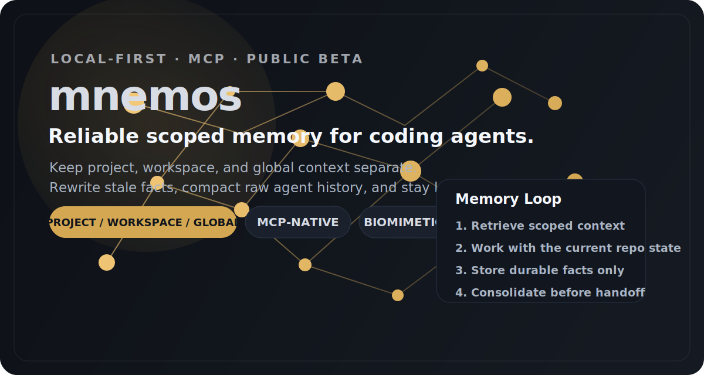

<p align="center">
  
</p>

<h1 align="center">mnemos</h1>

<p align="center">
  <strong>Local-first memory for coding agents that keeps project, workspace, and global context separate.</strong><br />
  Mnemos plugs into Claude Code and other MCP hosts, rewrites stale facts instead of appending forever, and compacts raw agent history into durable memory.
</p>

<p align="center">
  <a href="#quick-start"><strong>Quick start</strong></a> ·
  <a href="#mcp-integration"><strong>MCP setup</strong></a> ·
  <a href="docs/codex.md"><strong>Codex</strong></a> ·
  <a href="https://mnemos.making-minds.ai"><strong>Website</strong></a>
</p>

[](https://pypi.org/project/mnemos-memory/)
[](https://www.python.org/downloads/)
[](https://opensource.org/licenses/MIT)
[](https://mnemos.making-minds.ai)
[](https://modelcontextprotocol.io)

---

## What Mnemos Is

Mnemos is a local-first memory layer for coding agents. The v1 target is straightforward:

- safe scoped memory for solo agent workflows
- persistent local storage that survives restarts
- MCP compatibility for Claude Code, Claude Desktop, generic MCP hosts, and documented Codex setup
- biomimetic memory modules under the hood so retrieval stays compact and adaptive instead of append-only

This is not a hosted memory platform, team memory system, or remote sync product in v1.

---

## Public Beta

Mnemos is now in broad public beta. The core engine and onboarding control plane are ready for real coding-agent usage, and the intended setup path is:

1. `pip install "mnemos-memory[mcp]"`
2. `mnemos ui`
3. Choose a provider and review the local SQLite path
4. Apply Claude Code, Cursor, or Codex config from the UI
5. Run the built-in smoke check before daily use

If you are coming from an env-var or hand-edited MCP config setup, use the UI's **Import Existing Setup** action first.

Manual env-var setup is still supported for advanced users, but it is no longer the primary onboarding path. This beta is meant for real users and real workflows, but it is still a beta: use it, stress it, and report where setup, retrieval quality, or host behavior breaks down.

---

## Quick Start

```bash
pip install "mnemos-memory[mcp]"
mnemos ui
```

What the control plane gives you:

- canonical config in `mnemos.toml`
- optional project override in `.mnemos/mnemos.toml`
- guided host setup for Claude Code, Cursor, and Codex
- health checks, smoke checks, and a light memory viewer with chunk details

Inspectability entry points:

- `mnemos inspect <chunk-id>` for raw JSON inspection from the CLI
- `mnemos inspect <chunk-id> --query "..." --current-scope project --scope-id <repo>` to explain why a memory is relevant to a task
- `mnemos_inspect` for MCP-native hosts
- the control plane Memory panel for scope, provenance, revision history, and graph context

Feedback review loop:

- record a retrieval outcome with `mnemos-cli feedback helpful|not_helpful|missed_memory --query "..." [--chunk-id <id>]`
- review the highest-signal misses or bad recalls with `mnemos-cli feedback-list --event-type missed_memory` or `mnemos-cli feedback-list --event-type not_helpful`
- export events for offline eval work with `mnemos-cli feedback-export --format jsonl --output feedback-events.jsonl`

For advanced/manual setup, see [docs/MCP_INTEGRATION.md](docs/MCP_INTEGRATION.md).

---

## Why Use This Instead Of Built-In Claude Memory?

Claude Code already has built-in memory. Mnemos is narrower and more explicit:

- repo, workspace, and global memory stay scoped instead of blending together
- retrieval is inspectable, so you can see why a memory came back
- recall and curator form a repeatable workflow instead of silent accumulation
- everything persists in one local SQLite database

What curator is supposed to keep:

- stable repo conventions and tooling expectations
- environment and deployment constraints
- recurring bug causes and the real fix

What curator should skip:

- timestamps and command echoes
- one-off task status
- repetitive "still debugging" style chatter

If you want "memory exists somewhere in the background," Claude's built-in path may be enough. If you want scoped, local, inspectable continuity across coding sessions, Mnemos is the point.

See the side-by-side writeup at [docs/demos/claude-code-continuity.md](docs/demos/claude-code-continuity.md).

---

## Why The Architecture Is Different

Most agent memory tools either keep too much raw transcript or append contradictory facts forever. Mnemos uses a different design:

- **Reconstructive, not reproductive** — every recall rewrites the trace with current context
- **Recall-gated plasticity** — long-term consolidation prefers facts that can be re-instated from multiple episodic traces
- **Surprisal-gated** — the brain only encodes events that violate predictions
- **State-dependent** — fear retrieves fear, urgency retrieves crisis solutions
- **Lossy by design** — sleep compresses episodic logs into semantic abstractions and discards the rest
- **Associative** — remembering "server" pre-activates "AWS," "downtime," and "nginx" before you ask

mnemos implements these mechanisms as composable Python modules. They can be used independently or composed through `MnemosEngine`, but the product promise is narrower than the research inspiration: reliable scoped memory for agent workflows.

---

## Five Architectures

```
                    ┌─────────────────────────────────────────────────────┐
                    │                  SpreadingActivation                │
                    │                                                     │
                    │    "Docker bug"                                     │
                    │         │                                           │
                    │         ▼  energy = 1.0                             │
                    │   ┌───────────┐          ┌──────────────┐           │
                    │   │  Docker   │──0.80──▶│   Ubuntu     │           │
                    │   │ networking│          │  22.04 cfg   │           │
                    │   └───────────┘          └──────┬───────┘           │
                    │                                 │ 0.64              │
                    │   ┌───────────┐          ┌──────▼───────┐           │
                    │   │  old nginx│◀──0.51──│ nginx proxy  │           │
                    │   │  config   │          │    setup     │           │
                    │   └───────────┘          └──────────────┘           │
                    │                                                     │
                    │   Energy decays 20% per hop. Nodes above 0.3       │
                    │   threshold are returned — surfacing associative    │
                    │   context that vector search alone would miss.      │
                    └─────────────────────────────────────────────────────┘
```

### 1. `SurprisalGate` — Predictive Coding Memory Gate

> *Inspired by Friston's Active Inference / Predictive Processing: the brain encodes only prediction errors, not the expected.*

A fast LLM continuously predicts the user's next intent. When a new input arrives, mnemos computes the cosine distance between the prediction embedding and the actual input embedding. Low divergence (expected input) → discarded. High divergence (genuine surprise) → stored with a salience weight proportional to the prediction error.

This eliminates context bloat at the ingestion layer. A routine "sounds good" never touches long-term memory. "My production database just corrupted" gets maximum salience.

```python
from mnemos import MnemosEngine, MnemosConfig, SurprisalConfig, Interaction

engine = MnemosEngine(
    config=MnemosConfig(
        surprisal=SurprisalConfig(threshold=0.3)  # ~72° in embedding space
    )
)

result = await engine.process(Interaction(role="user", content="sounds good"))
# result.stored → False  (low surprisal, discarded)

result = await engine.process(Interaction(role="user", content="I'm migrating from Python to Rust"))
# result.stored → True   (high surprisal, salience ≈ 0.87)
# result.reason → "Surprisal 0.87 exceeds threshold 0.3"
```

---

### 2. `MutableRAG` — Memory Reconsolidation

> *Inspired by the destabilization-restabilization cycle: every act of recall makes the memory labile, allowing new context to be integrated before re-encoding.*

Standard RAG is append-only. When a user says "I use React" in 2024 and "I'm migrating to Rust" in 2026, both facts live forever. Every retrieval forces the LLM to spend tokens resolving the contradiction.

MutableRAG fixes this with a **Read-Evaluate-Mutate loop**. Retrieved chunks are flagged as "labile." A background async task checks whether the new conversational context contradicts or updates the stored fact. If it does, the original chunk is physically overwritten — not duplicated — with the synthesized update. The `version` counter on each `MemoryChunk` tracks how many times it has been reconsolidated.

```python
# After processing: "I use React for frontend work."
# Then later: "We're migrating to Svelte next quarter."

# On retrieval, MutableRAG detects the contradiction and rewrites in background:
memories = await engine.retrieve("frontend framework", reconsolidate=True)

# The stored chunk is now:
# "User is migrating from React to Svelte for frontend work." (version=2)
# The old "I use React" chunk no longer exists.
```

---

### 3. `AffectiveRouter` — Amygdala Filter

> *Inspired by Bower's (1981) mood-congruent memory theory and the amygdala's role in tagging memories with emotional salience.*

Embedding models retrieve on semantic similarity alone. A panicked "URGENT: server is down" retrieves the same as a calm "what's our server stack?" — the emotional context is invisible.

`AffectiveRouter` classifies every interaction on three axes — **valence** (−1 to +1), **arousal** (0 = calm to 1 = urgent), **complexity** (0 = simple to 1 = complex) — and attaches this `CognitiveState` as metadata. During retrieval, the scoring formula blends semantic similarity with affective state match:

```
final_score = (cosine_similarity × 0.7) + (state_match × 0.3)
```

When a user is panicking about a bug, mnemos surfaces how previous crises were resolved — not just semantically similar code snippets.

```python
from mnemos.types import CognitiveState

# A chunk encoded during a high-urgency incident:
# chunk.cognitive_state = CognitiveState(valence=-0.8, arousal=0.95, complexity=0.7)

# During a calm planning session, this chunk scores lower.
# During another incident, it rises to the top — because state matches.
```

---

### 4. `SleepDaemon` — Hippocampal-Neocortical Consolidation

> *Inspired by the two-stage memory model: the hippocampus stores fast, raw episodic traces; slow-wave sleep replays them to the neocortex, extracts semantic knowledge, and prunes the originals.*

Every interaction enters the episodic buffer regardless of the surprisal gate — the "hippocampus." When idle (configurable interval), `SleepDaemon` replays the buffer through an LLM consolidation pass, extracting permanent facts and user preferences. These are written as semantic `MemoryChunk` objects to long-term storage. The raw episodic buffer is then pruned.

When recall-gated plasticity is enabled, extracted facts are not consolidated just because the LLM proposed them. A candidate fact must also be strongly re-instated by multiple episodic traces in the current buffer before it is allowed to update semantic memory. This makes consolidation more selective in noisy sessions and gives Mnemos a practical analogue of recall-gated consolidation.

Optionally, the daemon identifies repeated reasoning patterns across sessions and generates Python tool code to automate them — declarative memory crystallizing into procedural reflex.

```python
# After a session of interactions:
result = await engine.consolidate()

print(result.facts_extracted)
# [
#   "User is a Python developer specializing in ML",
#   "User deploys models on AWS SageMaker",
#   "User's team uses GitHub Actions for CI/CD",
#   "User prefers Neovim and dark mode",
# ]

print(f"Pruned {result.chunks_pruned} raw episodes → {len(result.facts_extracted)} permanent facts")
```

---

### 5. `SpreadingActivation` — Energy-Based Graph RAG

> *Inspired by Collins & Loftus (1975) spreading activation theory: concepts in semantic memory are nodes in a network, activation propagates along edges and decays with distance.*

Vector search is a point-in-space lookup. It retrieves exact mathematical matches but misses the associative "train of thought." Hearing "Docker bug" should pre-activate "Ubuntu," "last Tuesday's deployment," and "nginx config" — not because they match the query string, but because they are connected in the memory graph.

`SpreadingActivation` injects activation energy (1.0) at the best-match node. Energy flows along graph edges, decaying 20% per hop. Every node above the activation threshold is included in the retrieval results, creating a moving spotlight of associative context.

```
"Docker bug" ──(1.0)──▶ node: "Docker networking issue from last week"
                              │(0.8)
                              ▼
                         node: "Ubuntu 22.04 server config"
                              │(0.64)
                              ▼
                         node: "nginx reverse proxy setup"  ← threshold: 0.3 ✓
                              │(0.51)
                              ▼
                         node: "old nginx config"           ← threshold: 0.3 ✓
```

```python
from mnemos import SpreadingActivation
from mnemos.config import SpreadingConfig

sa = SpreadingActivation(
    embedder=embedder,
    config=SpreadingConfig(
        initial_energy=1.0,
        decay_rate=0.2,        # 20% loss per hop
        activation_threshold=0.3,
        max_hops=3,
    )
)
```

---

> **Note:** The PyPI package is `mnemos-memory` but the import name is just `import mnemos`.

Zero external dependencies are required for experimentation. The default configuration uses `MockLLMProvider` and `SimpleEmbeddingProvider`, which are appropriate for demos and tests, not production retrieval quality.

### Python API

```python
import asyncio
from mnemos import MnemosEngine, Interaction

async def main():
    engine = MnemosEngine()  # MockLLM + SimpleEmbedding + InMemoryStore

    await engine.process(Interaction(role="user", content="I use Python for ML."))
    await engine.process(Interaction(role="user", content="I deploy on AWS SageMaker."))
    await engine.process(Interaction(role="user", content="Sure, sounds good."))  # filtered

    memories = await engine.retrieve("cloud infrastructure", top_k=3)
    for m in memories:
        print(m.content)

asyncio.run(main())
```

### CLI

```bash
mnemos-cli store "I use Python for ML."
mnemos-cli store "I deploy on AWS SageMaker."
mnemos-cli retrieve "cloud infrastructure" --top-k 3
mnemos-cli consolidate
mnemos-cli stats
```

**With Ollama (recommended for local production use):**

```bash
pip install 'mnemos-memory[ollama]'
```

```python
from mnemos import MnemosEngine, MnemosConfig
from mnemos.utils import OllamaProvider, SQLiteStore

engine = MnemosEngine(
    config=MnemosConfig(),
    llm=OllamaProvider(model="llama3"),
    store=SQLiteStore(db_path="memory.db"),
)
```

**With OpenAI:**

```bash
pip install 'mnemos-memory[openai]'
```

```python
from mnemos.utils import OpenAIProvider

engine = MnemosEngine(
    llm=OpenAIProvider(api_key="sk-...", model="gpt-4o-mini"),
    store=SQLiteStore(db_path="memory.db"),
)
```

---

## MCP Integration

mnemos ships a full [Model Context Protocol](https://modelcontextprotocol.io) server. Any MCP-compatible agent can call Mnemos tools natively, with the most polished path currently being Claude Code plus documented MCP setups for other hosts.

```bash
pip install 'mnemos-memory[mcp]'
```

### Claude Code Plugin Install (Like ClaudeMem)

This repository now includes a native Claude Code plugin package (`.claude-plugin/plugin.json`) that auto-wires Mnemos MCP.

```text
/plugin marketplace add anthony-maio/mnemos
/plugin install mnemos-memory@mnemos-marketplace
```

On first run, the plugin bootstraps a local virtual environment under `.claude-plugin/.venv`, installs Mnemos with MCP extras, and launches the MCP server over stdio.
It also ships Claude Code subagents for the default Mnemos workflow:
- `mnemos-recall` to pull scoped repo memory before substantial work
- `mnemos-curator` to keep only durable facts after meaningful work

Default plugin behavior:
- persistent SQLite memory store at `.claude-plugin/mnemos.db`
- automatic provider selection:
 - `openclaw` if `MNEMOS_OPENCLAW_API_KEY` exists
 - otherwise `openai` if `MNEMOS_OPENAI_API_KEY` exists
 - otherwise `ollama` if `MNEMOS_OLLAMA_URL` exists
 - otherwise `mock`
- embedding provider inferred from the selected LLM provider unless explicitly overridden

If you apply Claude host integration from the control plane, Mnemos also installs user-level agent files under `~/.claude/agents/` so these recall and curator workflows are available immediately in Claude Code.

The server exposes eight tools:

| Tool | Description |
|------|-------------|
| `mnemos_store` | Process a memory through the full pipeline (surprisal gate → affective tagging → graph), with optional `scope` + `scope_id` |
| `mnemos_retrieve` | Retrieve with spreading activation + emotional re-ranking + reconsolidation, with scoped filtering (`current_scope`, `scope_id`, `allowed_scopes`) |
| `mnemos_consolidate` | Trigger sleep consolidation: episodic buffer → semantic long-term memory |
| `mnemos_forget` | Delete a specific memory by ID |
| `mnemos_stats` | System-wide statistics across all modules |
| `mnemos_health` | Profile readiness and dependency diagnostics |
| `mnemos_inspect` | Full details on a specific memory chunk |
| `mnemos_list` | List all stored memories |

Readiness check:

```bash
mnemos-cli doctor
```

Threshold-aware doctor check:

```bash
mnemos-cli doctor --chunk-threshold 5000 --latency-p95-threshold-ms 250 --observed-p95-ms 180
```

One-command profile generation:

```bash
# Default local SQLite profile
mnemos-cli profile default --format dotenv --write .mnemos.profile.env
```

Store migration examples:

```bash
# Dry-run copying one SQLite database into another
mnemos-cli migrate-store --source-store sqlite --source-sqlite-path .mnemos/memory.db --target-store sqlite --target-sqlite-path .mnemos/memory-v2.db --dry-run

# Execute the SQLite copy or schema-upgrade move
mnemos-cli migrate-store --source-store sqlite --source-sqlite-path .mnemos/memory.db --target-store sqlite --target-sqlite-path .mnemos/memory-v2.db
```

Scoped memory examples (cross-project aware):

```bash
# Store project-scoped memory
mnemos-cli store "Use uv for Python tooling in this repo" --scope project --scope-id repo-alpha

# Store global preference memory
mnemos-cli store "Prefer concise summaries" --scope global

# Retrieve from current project plus global memory
mnemos-cli retrieve "tooling preferences" --current-scope project --scope-id repo-alpha --allowed-scopes project,global

# Audit current project memories
mnemos-cli list --scope project --scope-id repo-alpha --limit 20
mnemos-cli search "terraform" --scope project --scope-id repo-alpha
mnemos-cli export --scope project --scope-id repo-alpha --format jsonl --output .mnemos-export.jsonl

# Dry-run purge old project memories, then confirm
mnemos-cli purge --scope project --scope-id repo-alpha --older-than-days 30 --dry-run
mnemos-cli purge --scope project --scope-id repo-alpha --older-than-days 30 --yes
```

Onboarding + compatibility docs:
- [docs/clawhub-skill.md](docs/clawhub-skill.md)
- [docs/public-release-package.md](docs/public-release-package.md)
- [docs/release-checklist.md](docs/release-checklist.md)
- [docs/codex.md](docs/codex.md)
- [docs/cursor-antigravity.md](docs/cursor-antigravity.md)
- [docs/mcp-transport-contract.md](docs/mcp-transport-contract.md)
- [docs/client-compatibility-matrix.md](docs/client-compatibility-matrix.md)

### Codex via MCP + `AGENTS.md`

Codex support in v1 is MCP-first rather than plugin-first. Use the documented setup in [docs/codex.md](docs/codex.md) and generate the repo policy text with:

```bash
mnemos-cli antigravity codex --target codex-agents
```

That flow keeps Codex on the same scoped `retrieve -> work -> store -> consolidate` loop as Claude Code. Optional Codex Automations can help with scheduled Mnemos hygiene checks, but they are not chat-session hooks and do not change the hard auto-capture story.

### Claude Code / Claude Desktop

Add to `~/.claude/claude_desktop_config.json`:

```json
{
  "mcpServers": {
    "mnemos": {
      "command": "python",
      "args": ["-m", "mnemos.mcp_server"],
      "env": {
        "MNEMOS_LLM_PROVIDER": "mock",
        "MNEMOS_EMBEDDING_PROVIDER": "simple",
        "MNEMOS_STORE_TYPE": "sqlite",
        "MNEMOS_SQLITE_PATH": "~/.mnemos/memory.db"
      }
    }
  }
}
```

This is the minimal tested Tier 1 config. Swap `mock` and `simple` to `ollama`,
`openai`, or `openclaw` when you want real retrieval quality.

### Cursor

Add to `.cursor/mcp.json` in your project root:

```json
{
  "mcpServers": {
    "mnemos": {
      "command": "mnemos-mcp",
      "env": {
        "MNEMOS_LLM_PROVIDER": "mock",
        "MNEMOS_STORE_TYPE": "sqlite",
        "MNEMOS_SQLITE_PATH": ".mnemos/memory.db"
      }
    }
  }
}
```

For soft-auto usage in Cursor, also add a project rule:

```bash
mnemos-cli antigravity cursor --target cursor-rule --write .cursor/rules/mnemos-memory.mdc
```

The control plane now writes both `.cursor/mcp.json` and `.cursor/rules/mnemos-memory.mdc` for Cursor projects.

### OpenClaw / ClawHub Skill

This repo ships a ClawHub-ready skill at `skills/mnemos-memory`. It teaches OpenClaw agents how to install `mnemos-memory[mcp]`, run `mnemos ui`, wire `mnemos-mcp`, and operate the `retrieve -> work -> store -> consolidate` loop. It is an onboarding/use skill, not a claim of built-in hard auto-capture hooks for OpenClaw hosts.

### Windsurf

Add to `~/.windsurf/mcp.json`:

```json
{
  "mcpServers": {
    "mnemos": {
      "command": "mnemos-mcp",
      "env": {
        "MNEMOS_LLM_PROVIDER": "mock",
        "MNEMOS_STORE_TYPE": "sqlite",
        "MNEMOS_SQLITE_PATH": "~/.mnemos/memory.db"
      }
    }
  }
}
```

Once configured, you can tell your agent:

```
"Remember that I use Neovim and prefer dark mode."
"What do you know about my infrastructure setup?"
"Consolidate what you've learned from our conversation."
"Forget the memory about the old server IP."
```

The agent's memory now filters the mundane, tags emotional context, updates stale facts on recall, and compresses session logs into lasting knowledge — automatically.

For deterministic Claude Code auto-memory, use the shipped hook config at [docs/claude-code-hooks.json](docs/claude-code-hooks.json). It auto-ingests user prompts and high-signal tool failures via `mnemos-cli autostore-hook`, then consolidates on `PreCompact`/`Stop`.

Memory writes now pass through a shared safety firewall across ingestion, reconsolidation, and sleep consolidation. Configure with:
- `MNEMOS_MEMORY_SAFETY_ENABLED` (`true` by default)
- `MNEMOS_MEMORY_SECRET_ACTION` (`block` default)
- `MNEMOS_MEMORY_PII_ACTION` (`redact` default)

Governance controls for retention and growth limits:
- `MNEMOS_MEMORY_CAPTURE_MODE` (`all` | `manual_only` | `hooks_only`)
- `MNEMOS_MEMORY_RETENTION_TTL_DAYS` (`0` disables TTL pruning)
- `MNEMOS_MEMORY_MAX_CHUNKS_PER_SCOPE` (`0` disables per-scope cap)

---

## Architecture Diagram

```
                         ┌──────────────────────────────────────┐
                         │           MnemosEngine                │
                         └──────────────────────────────────────┘

  ENCODE PATH (process)
  ──────────────────────────────────────────────────────────────────────────
  Interaction
      │
      ├─────────────────────────────────────────────────────────▶ SleepDaemon
      │                                                          (episodic buffer)
      ▼
  SurprisalGate ──── low surprisal ──▶ [DISCARD]
      │
      │ high surprisal
      ▼
  AffectiveRouter
  (classify valence / arousal / complexity → tag CognitiveState)
      │
      ▼
  MemoryStore (SQLite / InMemory)
      │
      ▼
  SpreadingActivation.add_node()
  (auto-connect to semantic neighbors in graph)


  RETRIEVE PATH (retrieve)
  ──────────────────────────────────────────────────────────────────────────
  Query
      │
      ├──▶ AffectiveRouter.classify_state(query)
      │
      ├──▶ SpreadingActivation.retrieve()
      │    (inject energy → propagate along edges → threshold filter)
      │
      ├──▶ AffectiveRouter.retrieve()
      │    score = similarity × 0.7 + state_match × 0.3
      │
      ├──▶ Merge + re-rank (activation boost for graph-connected nodes)
      │
      └──▶ MutableRAG.flag_labile() → async reconsolidation background task


  MAINTENANCE PATH (consolidate)
  ──────────────────────────────────────────────────────────────────────────
  Idle trigger
      │
      ▼
  SleepDaemon
      │
      ├──▶ LLM: extract permanent facts from episodic buffer
      ├──▶ (optional) recall gate: require multi-episode support before LTM write
      ├──▶ Write semantic MemoryChunks to long-term store
      ├──▶ Add new nodes to SpreadingActivation graph
      ├──▶ Prune raw episodic buffer
      └──▶ (optional) Proceduralize repeated patterns → generate Python tools
```

---

## Configuration

All configuration is expressed as Pydantic models and can be serialized to/from JSON/YAML.

```python
from mnemos import MnemosEngine, MnemosConfig
from mnemos.config import (
    SurprisalConfig, MutableRAGConfig,
    AffectiveConfig, SleepConfig, SpreadingConfig
)

config = MnemosConfig(
    surprisal=SurprisalConfig(threshold=0.25),
    sleep=SleepConfig(consolidation_interval_seconds=1800),
    spreading=SpreadingConfig(decay_rate=0.15, max_hops=4),
    debug=True,
)
engine = MnemosEngine(config=config)
```

### Key Options

| Module | Parameter | Default | Description |
|--------|-----------|---------|-------------|
| `SurprisalConfig` | `threshold` | `0.3` | Cosine distance threshold for encoding. Higher = stricter gate, fewer memories stored. |
| `SurprisalConfig` | `history_window` | `10` | Recent turns used for intent prediction. |
| `MutableRAGConfig` | `enabled` | `True` | Toggle async reconsolidation on retrieval. |
| `MutableRAGConfig` | `reconsolidation_cooldown_seconds` | `60` | Minimum gap between reconsolidations of the same chunk. |
| `AffectiveConfig` | `weight_similarity` | `0.7` | Semantic similarity weight in retrieval scoring. |
| `AffectiveConfig` | `weight_state` | `0.3` | Affective state match weight in retrieval scoring. |
| `SleepConfig` | `consolidation_interval_seconds` | `3600` | Minimum idle time before consolidation triggers. |
| `SleepConfig` | `min_episodes_before_consolidation` | `10` | Minimum episodic buffer depth before consolidation. |
| `SleepConfig` | `enable_proceduralization` | `False` | Generate Python tools from repeated reasoning patterns. |
| `SleepConfig` | `recall_gated_plasticity_enabled` | `False` | Require episodic recall support before a consolidated fact can alter long-term memory. |
| `SleepConfig` | `recall_min_supporting_episodes` | `2` | Minimum number of supporting episodic traces required when recall gating is enabled. |
| `SleepConfig` | `recall_similarity_threshold` | `0.82` | Minimum episodic similarity needed for a trace to count as recall support. |
| `SpreadingConfig` | `initial_energy` | `1.0` | Activation energy injected at seed node. |
| `SpreadingConfig` | `decay_rate` | `0.2` | Energy lost per graph hop (20%). |
| `SpreadingConfig` | `activation_threshold` | `0.3` | Minimum energy for a node to be included in results. |
| `SpreadingConfig` | `max_hops` | `3` | Maximum graph traversal depth. |
| `SpreadingConfig` | `auto_connect_threshold` | `0.6` | Minimum cosine similarity for auto-connecting new nodes. |

### MCP Server Environment Variables

| Variable | Default | Description |
|----------|---------|-------------|
| `MNEMOS_LLM_PROVIDER` | `mock` | `mock`, `ollama`, `openai`, or `openclaw` |
| `MNEMOS_LLM_MODEL` | `llama3` | Model name for the LLM provider |
| `MNEMOS_OLLAMA_URL` | `http://localhost:11434` | Ollama API base URL |
| `MNEMOS_OPENAI_API_KEY` | — | Required when using `openai` provider |
| `MNEMOS_OPENAI_URL` | `https://api.openai.com/v1` | OpenAI-compatible API base URL |
| `MNEMOS_OPENCLAW_API_KEY` | — | OpenClaw API key (or fallback to `MNEMOS_OPENAI_API_KEY`) |
| `MNEMOS_OPENCLAW_URL` | — | OpenClaw API base URL (or fallback to `MNEMOS_OPENAI_URL`) |
| `MNEMOS_EMBEDDING_PROVIDER` | inferred from `MNEMOS_LLM_PROVIDER`, else `simple` | `simple`, `ollama`, `openai`, or `openclaw` |
| `MNEMOS_EMBEDDING_MODEL` | provider-dependent | Embedding model name (e.g. `nomic-embed-text`) |
| `MNEMOS_EMBEDDING_DIM` | `384` | Embedding dimension for `simple` provider |
| `MNEMOS_STORE_TYPE` | `memory` | `memory` or `sqlite` |
| `MNEMOS_SQLITE_PATH` | `mnemos_memory.db` | SQLite database path |
| `MNEMOS_SURPRISAL_THRESHOLD` | `0.3` | Surprisal gate sensitivity |
| `MNEMOS_DEBUG` | `false` | Enable verbose debug logging |

Backward-compatible aliases are supported for migration:
- `MNEMOS_STORAGE` -> `MNEMOS_STORE_TYPE`
- `MNEMOS_DB_PATH` -> `MNEMOS_SQLITE_PATH`

If `MNEMOS_EMBEDDING_PROVIDER` is unset, Mnemos now infers it from `MNEMOS_LLM_PROVIDER` for `ollama`, `openai`, and `openclaw`. Set it explicitly to `simple` if you want the lightweight fallback.

---

## Compatibility and Release Posture

Mnemos is ready for a disciplined public open-source release. It is not yet ready for “definitive replacement” claims across every host and workflow. The verified public surface today is:

| Client / Surface | Status | Notes |
|---|---|---|
| Claude Code | Tier 1 supported | Primary install path via plugin; validated end-to-end on the default local SQLite path. |
| Claude Desktop | Tier 1 supported | Minimal tested stdio config ships in the repo. |
| Generic MCP stdio hosts | Tier 1 supported | Validated against the live MCP server. |
| Codex | Tier 2 documented | Supported through MCP + a stronger `AGENTS.md` pack and optional maintenance Automations; host-hook auto-capture is still not shipped. |
| Cursor / Windsurf / Cline | Tier 2 best effort | Configs and docs exist; Cursor now has a `.cursor/rules` soft-auto path, but host-hook auto-capture is not yet shipped. |

The current product promise is narrower than the architecture story:

- safe scoped memory for solo coding-agent workflows
- local-first persistence with a single SQLite database
- biomimetic retrieval and consolidation under the hood
- verified Tier 1 support for Claude Code, Claude Desktop, and generic MCP hosts

Source-of-truth release docs:

- [docs/public-release-package.md](docs/public-release-package.md)
- [docs/release-checklist.md](docs/release-checklist.md)
- [docs/client-compatibility-matrix.md](docs/client-compatibility-matrix.md)
- [docs/codex.md](docs/codex.md)
- [SUPPORT.md](SUPPORT.md)
- [SECURITY.md](SECURITY.md)
- [CONTRIBUTING.md](CONTRIBUTING.md)
- [CODE_OF_CONDUCT.md](CODE_OF_CONDUCT.md)

---

## Tech Stack

**Core (zero optional dependencies for quick start):**
- `numpy >= 1.24` — embedding arithmetic and cosine similarity
- `pydantic >= 2.0` — validated config and domain types
- `httpx >= 0.24` — async HTTP for LLM providers

**Optional (install what you need):**
- `ollama` — local LLM inference via Ollama (`pip install 'mnemos-memory[ollama]'`)
- `openai` — OpenAI or any OpenAI-compatible API (`pip install 'mnemos-memory[openai]'`)
- `mcp` — MCP server for Claude Code, Claude Desktop, generic MCP hosts, and documented Codex setup (`pip install 'mnemos-memory[mcp]'`)

**Install everything:**
```bash
pip install 'mnemos-memory[all]'
```

**Storage backends built-in:**
- `InMemoryStore` — zero setup, for development and testing
- `SQLiteStore` — persistent, zero external services, suitable for personal deployments

## Retrieval Benchmark Harness

Run reproducible retrieval benchmarks with `Recall@k`, `MRR`, and `p95` latency:

```bash
mnemos-benchmark --stores memory,sqlite --retrievers baseline,engine --top-k 5
```

You can provide a custom dataset (`.json` or `.jsonl`) with `id`, `content`, and `queries` (plus optional scoped fields like `scope`, `scope_id`, query-level `allowed_scopes`):

```bash
mnemos-benchmark --stores sqlite --retrievers baseline,engine --dataset ./benchmarks/retrieval.jsonl --top-k 10
```

Replacement-claim gate run:

```bash
mnemos-benchmark --stores memory --retrievers baseline,engine --dataset-pack claim-driving --top-k 1 --enforce-production-gate
```

Gate output fields live under `gates.production_replacement.*`.
Use `--baseline-scope-aware` if you want baseline retrieval to apply scope filters in scoped-memory datasets.

## Release Checklist

Use [docs/release-checklist.md](docs/release-checklist.md) before tagging a release candidate or making category-defining claims.

For public launch framing, approved claims, and feedback routing, use [docs/public-release-package.md](docs/public-release-package.md).

---

## Contributing

Contributions are welcome. The codebase follows a clean module boundary, and the release bar is intentionally strict around scope isolation, persistence, and MCP behavior.

```bash
git clone https://github.com/anthony-maio/mnemos
cd mnemos
pip install -e '.[dev]'
pytest
```

**Good first contributions:**
- Proceduralization quality improvements in `SleepDaemon`
- Inspectability and memory audit UX improvements
- Benchmarks comparing retrieval quality against standard RAG baselines
- Cross-host soft-auto workflow polish for Codex and Cursor

Before large changes, open the relevant issue template and read [CONTRIBUTING.md](CONTRIBUTING.md), [SUPPORT.md](SUPPORT.md), and [docs/release-checklist.md](docs/release-checklist.md). Keep PRs focused: one feature, fix, or doc change per PR.

---

## License

MIT — see [LICENSE](LICENSE).

---

## Citation

If you use mnemos in research, please cite:

```bibtex
@software{maio2026mnemos,
  author       = {Maio, Anthony},
  title        = {mnemos: Biomimetic Memory Architectures for Large Language Models},
  year         = {2026},
  version      = {0.6.0},
  url          = {https://github.com/anthony-maio/mnemos},
  note         = {Implements surprisal-triggered encoding, memory reconsolidation,
                  affective routing, hippocampal-neocortical consolidation, and
                  spreading activation for LLM memory systems.}
}
```

---

*mnemos* (μνῆμος) — from Ancient Greek, meaning "mindful" or "remembering." The name of the daemon in Greek mythology associated with memory.

Built by [Anthony Maio](mailto:anthony.maio@gmail.com).
